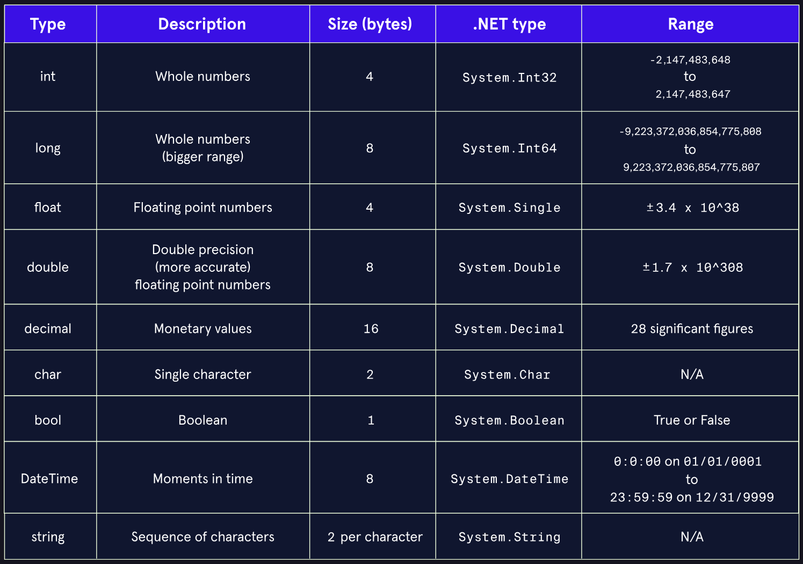

# Lesson: Data types and variables

###### Image of Data Types within C#

This lesson focused on the different data types and the first stages of converting between different data types.

# Lesson: Working with numbers

