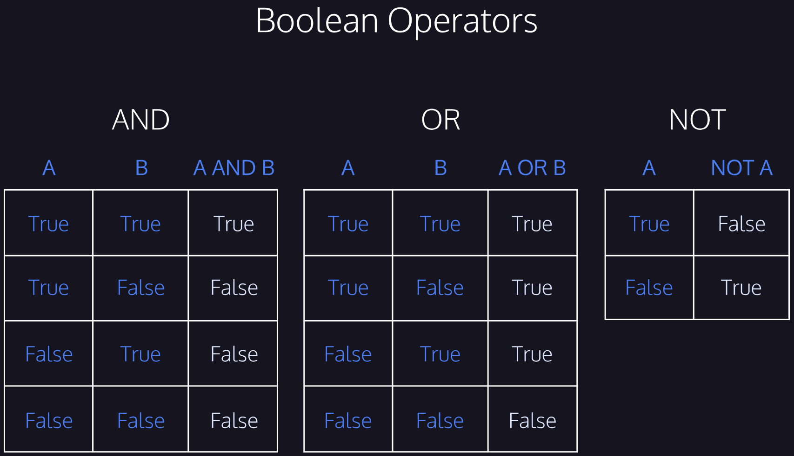

# Lesson: Logic and Conditionals

The focus for this lesson is to explore how C# uses logic to explore relationships between two or more variables. This begins my exploring the Boolean logic behind C#.

###### Image of Boolean Operators

# Lesson: Understanding Logic in C#

This lesson introduced variables of the bool data type. It also included how to use comparison operators with different data types to return boolean values.